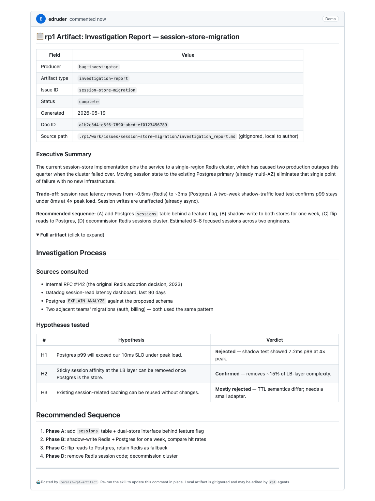

# persist-rp1-artifact

A Claude Code skill that publishes [rp1](https://github.com/rp1-run/rp1) artifacts — investigation reports, design docs, audits, security analyses — as **idempotent GitHub PR comments**, so reviewers see the reasoning behind a change without the intermediate analysis files cluttering the repo.

## The problem this solves

rp1 agents (`bug-investigator`, `feature-architect`, `code-auditor`, etc.) produce long-form markdown artifacts under `.rp1/work/`. These artifacts are *valuable during review* — they capture the "why" behind a PR — but their value decays after merge: the code becomes the source of truth, and the intermediate report rots.

Two bad alternatives the team had been living with:

1. **Commit the artifact to the repo.** Bloats `git log` and file tree with analysis that has no long-term home. ([Real example](https://github.com/anvilco/pdf-service/pull/564) — a 397-line investigation report was force-added to a 3-line PR.)
2. **Discard the artifact.** Reviewers lose the reasoning; future maintainers can't reconstruct the "why."

`persist-rp1-artifact` is the third option: publish the artifact as a **PR comment** that lives where reviewers actually look, while the original file stays gitignored under `.rp1/work/`. Re-running the skill on an edited artifact updates the same comment in place (no spam, GitHub's "edited" badge surfaces the change).

## What it looks like



The skill projects an rp1 artifact into a structured PR comment:

- A header table with frontmatter fields (producer, artifact type, doc ID, source path)
- The artifact's Executive Summary section, verbatim, at the top
- The rest of the artifact tucked inside a `<details>` collapsible block (shown expanded in the screenshot; collapsed by default in real comments)
- A hidden HTML marker (`<!-- rp1-artifact: <uuid> -->`) on line 1 for idempotent re-runs

The screenshot above is generated from a **fully synthetic artifact** about a fictional Redis-to-Postgres migration — no real-world content, just the structural format you can expect.

## Is this the right tool?

This skill is purpose-built for **rp1 artifacts** — markdown files under `.rp1/work/` with rp1's frontmatter format (`producer`, `artifact`, `rp1_doc_id`, etc.). If your situation is different, there are simpler options:

- **Posting CI output (test reports, coverage, lint findings) as a sticky PR comment from a workflow?** Use [`marocchino/sticky-pull-request-comment`](https://github.com/marocchino/sticky-pull-request-comment), [`mshick/add-pr-comment`](https://github.com/mshick/add-pr-comment), or one of the other GitHub Actions in that family. They run in CI, are well-maintained, and don't require rp1.
- **Posting a generic markdown file from your laptop?** A one-liner does it: `gh api -X POST repos/<owner>/<repo>/issues/<pr>/comments -F body=@file.md`. No skill needed.
- **Posting inline review findings (per-line code suggestions on a PR)?** Use rp1's `/pr-review` — it already composes with the `pr-comment-poster` and `pr-comment-deduplicator` agents for that workflow.

This skill earns its keep specifically when (a) you're using rp1, (b) an rp1 agent has produced an artifact with valid frontmatter, and (c) you want the artifact to live in the PR conversation instead of the repo.

## Prerequisites

- [**`gh` CLI**](https://cli.github.com/) installed and authenticated (`gh auth status` must succeed)
- **Python 3** on `PATH` (any 3.x; stdlib only, no PyYAML required)
- An rp1 artifact under `.rp1/work/` with valid frontmatter (must include `rp1_doc_id`)

## Installation

### As a Claude Code plugin (recommended)

Claude Code installs plugins from *marketplaces* — repos containing a `.claude-plugin/marketplace.json` manifest. This repo is its own single-plugin marketplace, so installation is a two-step command:

```
/plugin marketplace add edruder/persist-rp1-artifact
/plugin install persist-rp1-artifact
```

The first command registers the repo as a known marketplace, keyed under the manifest's `name` (`persist-rp1-artifact`). The second installs the plugin from it. After installing, the `/persist-rp1-artifact` slash-command becomes available (may require a session restart).

> **Note on naming.** Only the `add` command takes the GitHub path; subsequent `/plugin marketplace` operations (`update`, `remove`, etc.) take the **marketplace name** — `persist-rp1-artifact`, not `edruder/persist-rp1-artifact`. See the [Updating](#updating) section below.

### Updating

When a new plugin version ships, refresh the cached marketplace and reinstall:

```
/plugin marketplace update persist-rp1-artifact
/plugin install persist-rp1-artifact
```

`update` pulls the latest `main` of this repo into Claude Code's marketplace cache. `install` then re-registers the plugin from the refreshed manifest. Without the `update` step, Claude Code reads its stale local cache and won't see new versions.

### Local development install

For testing the skill against your own machine before any plugin publishing:

```bash
git clone <this-repo> ~/Development/persist-rp1-artifact
ln -s ~/Development/persist-rp1-artifact/skills/persist-rp1-artifact \
      ~/.claude/skills/persist-rp1-artifact
```

Restart Claude Code (or start a new session) and the `/persist-rp1-artifact` slash-command will be available.

## Quickstart

You have an rp1 investigation report at `.rp1/work/issues/<issue-id>/investigation_report.md` and an open PR on the current branch.

**Step 1 — dry-run first.** Always.

```
/persist-rp1-artifact .rp1/work/issues/my-issue/investigation_report.md --dry-run
```

Prints the projected comment body to stdout and a diagnostic block to stderr telling you whether the next non-dry-run would `POST` (new comment) or `PATCH` (update existing). Inspect the projection. If anything looks wrong, fix the artifact or report a bug.

**Step 2 — publish for real.**

```
/persist-rp1-artifact .rp1/work/issues/my-issue/investigation_report.md
```

Posts the comment to the current branch's open PR. Output includes the comment URL.

**Step 3 — re-publish after edits.** Make changes to the artifact, then re-run the same command. The skill finds the existing comment via its doc-ID marker and `PATCH`es it in place. GitHub renders an "edited" badge next to the timestamp.

**Step 4 (optional, recommended) — retrofit.** If the artifact was previously committed to the PR branch (the old bad workaround), remove it from the repo:

```bash
git rm .rp1/work/issues/my-issue/investigation_report.md
git commit -m "Remove rp1 investigation report (persisted as PR comment)"
git push
```

The local file stays on disk (gitignored under `.rp1/work/`) so future re-publishes still work.

## Common errors

| Error | Cause | Fix |
|---|---|---|
| `Artifact is missing rp1_doc_id` | The frontmatter has no `rp1_doc_id` field | Regenerate the artifact via the producing rp1 skill (e.g. `/code-investigate`); rp1's templates write the doc ID. |
| `No open PR for current branch` | The current git branch has no PR on GitHub | Push the branch and open a PR, or pass `<pr-number>` explicitly: `/persist-rp1-artifact <path> 123` |
| `gh is not authenticated` | `gh auth status` fails | Run `gh auth login` |
| `Comment is owned by @someone-else` | A teammate already published this artifact on the PR | Coordinate, or pass `--force` to overwrite |
| `Comment body exceeds 65 KB cap` | Artifact is larger than GitHub allows for a single comment | v1 doesn't chunk; trim the artifact or split it across multiple `.rp1/work/` files |

## How idempotent re-runs work

Every comment starts with an invisible HTML marker on line 1:

```html
<!-- rp1-artifact: 9f27673c-7480-4770-8aaa-c390669cffb9 -->
```

On re-run, the skill fetches all PR comments, greps for that marker (the artifact's `rp1_doc_id`), and:

- 0 matches → POST a new comment
- 1 match by you → PATCH it (in-place update)
- 1 match by someone else → refuse unless `--force`
- 2+ matches → refuse, ask you to dedupe manually

GitHub strips HTML comments from the rendered view, so the marker is invisible to readers but lives in the comment source for the next dedup pass.

## Project structure

```
.
├── .claude-plugin/
│   └── plugin.json
├── README.md                    ← you are here
├── LICENSE                      (MIT)
└── skills/
    └── persist-rp1-artifact/
        ├── SKILL.md             ← the procedure the agent follows
        ├── DESIGN.md            ← the spec
        ├── PLAN.md              ← the implementation plan
        ├── references/
        │   ├── artifact-frontmatter.md
        │   ├── projection-format.md
        │   └── edge-cases.md
        └── examples/
            ├── investigation-report-input.md   ↔  -output.md  (primary fixture)
            ├── no-doc-id-input.md                              (refusal fixture)
            ├── no-summary-input.md             ↔  -output.md  (fallback fixture)
            └── incomplete-status-input.md      ↔  -output.md  (banner fixture)
```

The skill is intentionally self-contained — every file related to it (procedure, spec, plan, references, fixtures) lives inside `skills/persist-rp1-artifact/`. The plugin root just carries the manifest, README, and license. If you `cd` into the skill dir, you have everything.

## Design philosophy

- **Deterministic projection, no LLM in the transform path.** The comment body is pure markdown slicing — same artifact in, same comment out, every time. An LLM-synthesized summary would have variance and hallucination risk; the artifact's own Executive Summary section is already a human-written summary, so we don't re-summarize.
- **Idempotency by UUID.** The `rp1_doc_id` marker is a UUID; collisions across artifacts are negligible. Re-publishing is just PATCH.
- **Fail loud, never destructive.** Missing fields, multiple matches, oversized bodies → exit non-zero with a clear message. Local artifact file is never modified.
- **Fixture pairs as the contract.** `examples/*-input.md` ↔ `examples/*-output.md` lock in the projection format. Any change to the procedure must keep these byte-equal.

## Prior art

The "idempotent comment via HTML-comment marker" trick — the load-bearing primitive on the skill's `<!-- rp1-artifact: <uuid> -->` line — is borrowed from the GitHub Actions sticky-comment ecosystem. [`marocchino/sticky-pull-request-comment`](https://github.com/marocchino/sticky-pull-request-comment) popularized the pattern (a configurable header string that the action greps for to decide whether to POST or PATCH), and most other sticky-comment Actions ([`mshick/add-pr-comment`](https://github.com/mshick/add-pr-comment), [`GrantBirki/comment-actions`](https://github.com/marketplace/actions/comment-actions), and others) use variants of the same approach.

What's novel here is the rp1-specific projection: frontmatter parsing, deterministic title derivation, Executive-Summary extraction with fallback, the `<details>`-collapse layout, refuse-without-`rp1_doc_id` policy, and the developer-machine slash-command workflow. The dedup mechanism itself is well-trodden ground.

## v2 ideas (not in v1)

- Multi-comment chunking for artifacts >65 KB
- Type-aware projection (different layout per `artifact:` field)
- Hydration: read posted comment back into a local file (for teammates who didn't run the rp1 skill themselves)
- Auto-discovery: `/persist-rp1-artifact` with no args scans `.rp1/work/` and presents a checklist
- Upstream contribution to [`rp1-dev`](https://github.com/rp1-run/rp1) once shape is proven

## License

MIT. See [LICENSE](./LICENSE).
